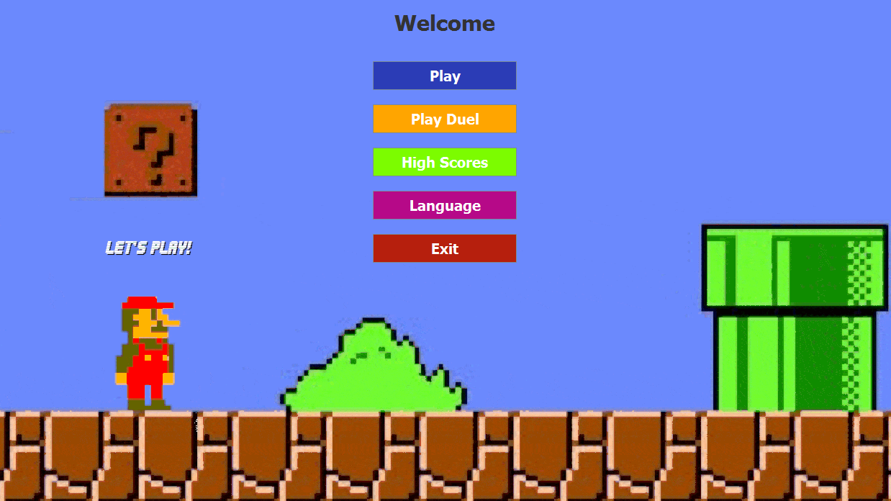
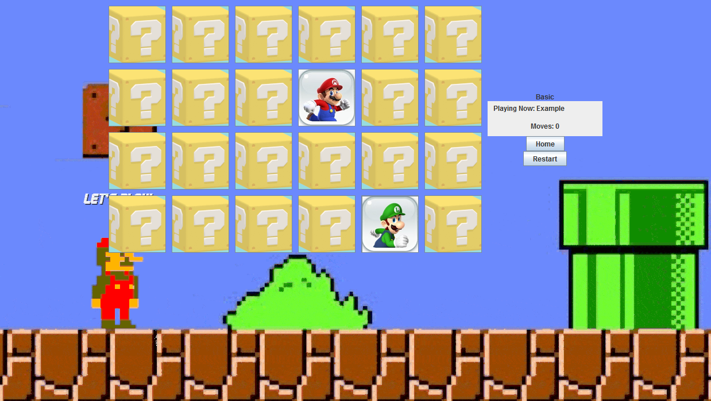

# Memory-Card-Game
A **Memory Card Game (Super Mario Theme)** versus Players/Bots, with Super Mario images and music.

________

  <b>Game Interface Screenshots</b>

  

  

________
### Bot Levels

* **Easy** - Goldfish (no memory)
* **Medium** - Kangaroo (remembers half of the cards opened)
* **Hard** - Elephant (remembers all of the cards opened)

________
### Credits

Logic Implementation: mainly [@SotirisFtiakas](https://github.com/SotirisFtiakas) (me)

Graphics Implementation: mainly [@GregB712](https://github.com/GregB712) (contributor)
